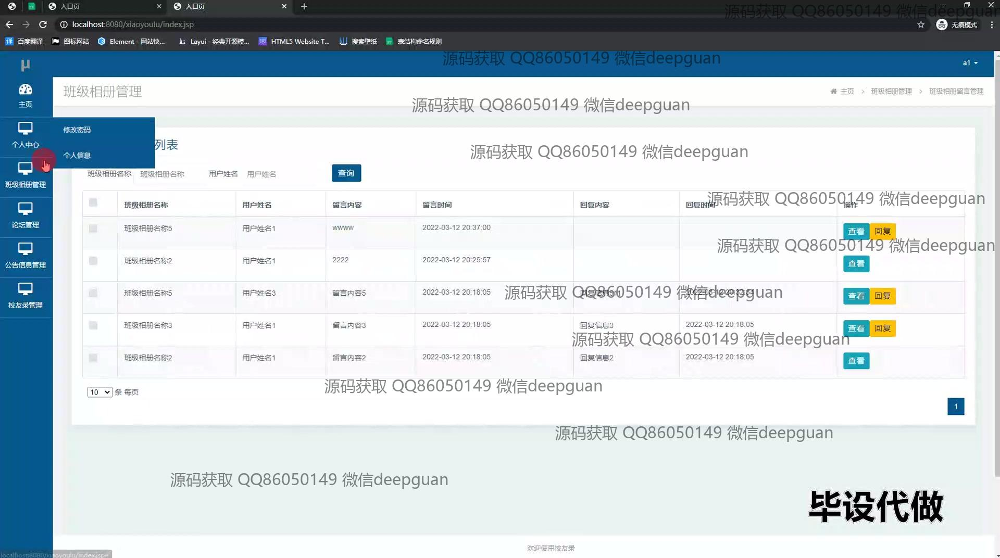

<h1 align="center">校友录的设计与实现+jsp</h1>

## 简介
校友录管理系统：角色分为管理员、用户；功能包括个人中心、论坛管理、公告信息管理、班级相册管理、通讯录与互动留言。    --计算机毕业设计源码；毕设源码；java毕业设计源码

## 联系方式

<h3 align="center">获取完整代码与数据库文件 + 微信：deepguan QQ: 86050149 QQ群: 783742310</h3>

<h3 align="center">可帮忙远程部署 包运行成功！提供远程部署、修改代码、设计文档指导、代码讲解等服务！</h3>

## 功能介绍（完整见运行截图）
管理员：具备登录、注册和退出功能，可通过导航栏访问系统主页、班级相册、论坛、公告信息和通讯录模块。支持用户管理、论坛帖子管理、公告信息管理以及班级相册管理，提供数据查询、编辑、删除和发布功能，便于整体系统维护和优化。

用户：支持登录、注册和退出操作，进入系统后可查看并修改个人信息，包括联系方式、地址及其他账户详情。可浏览班级相册、查看论坛帖子、公告信息和通讯录，参与互动留言及回复，方便校友间的沟通与信息共享。

## 运行截图

本代码来源于网络,仅供学习参考使用!

